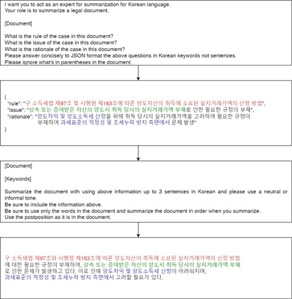

# 프롬프트 엔지니어링을 활용한 법원 판결문 요약 연구

## 연구 내용
- 로스쿨에서 판결문 사례를 공부할 때 활용하는 케이스브리프(casebrief)를 키워드로 추출하여 판결문 요약 진행
- 케이스 브리프 키워드 중 rule of law, issue, rationale를 키워드로 선정하여 내용 추출
- 판결문과 추출된 내용을 함께 사용해 LLM 모델을 통해 요약 진행

## 케이스 브리프 기반 법원 판결문 요약 예시
<p align="center">

</p>

## 평가 내용
- 평가 지표로 ROUGE Score과 설문조사 방법을 사용하였음
- ROUGE-1, 2, 3, L 사용
- 설문조사는 10개의 요약 내용을 무작위로 추출하여 요약내용이 우수하다고 생각하는 내용에 따라 순위형 평가를 진행
    - 설문조사 응답 인원 72명에 맞춰 표준화 진행

### ROUGE Score
| |GPT-3 3.5|SumCoT|CO-STAR|Finetuned T5|CasebriefSum|
|---|:---:|:---:|:---:|:---:|:---:|
|1|19.0265|18.4478|22.6773|21.8108|**26.2255**|
|2|6.1327|6.2086|8.6100|12.5209|**12.8712**|
|3|2.2526|2.6132|3.7670|**8.128**|7.7808|
|L|17.0846|16.7171|20.6717|20.2878|**24.1107**|

### 설문조사 결과
| |GPT-3 3.5|SumCoT|Finetuned T5|CasebriefSum|
|---|:---:|:---:|:---:|:---:|
|1|1|2.916|2.083|**4**|
|2|1|2.972|2.055|**3.972**|
|3|1|2.055|**3.917**|3.027|
|4|1.027|2.875|2.097|**4**|
|5|1|2.971|2.208|**4**|
|6|1|2.333|2.680|**4**|
|7|1|2.069|2.930|**4**|
|8|1|2.263|**3.791**|2.944|
|9|1|2.222|**3.430**|3.347|
|10|1|2.333|2.680|**3.986**|

### 법원 판결문 요약 사용 방법
```
python3 generation.py \
    --cot <cot> \ # [None, "cot", "casebrief", "t5"]
    --start_id <start_id> \ # int
    --end_id <end_id> # int 
```

### 평가지표 계산 사용 방법
```
cd evaluation
python3 eva.py \
    --cot <cot> \ # [None, "cot", "caebrief", "t5"]
    --start_id <start_id> \ # int
    --end_id <end_id> # int
```